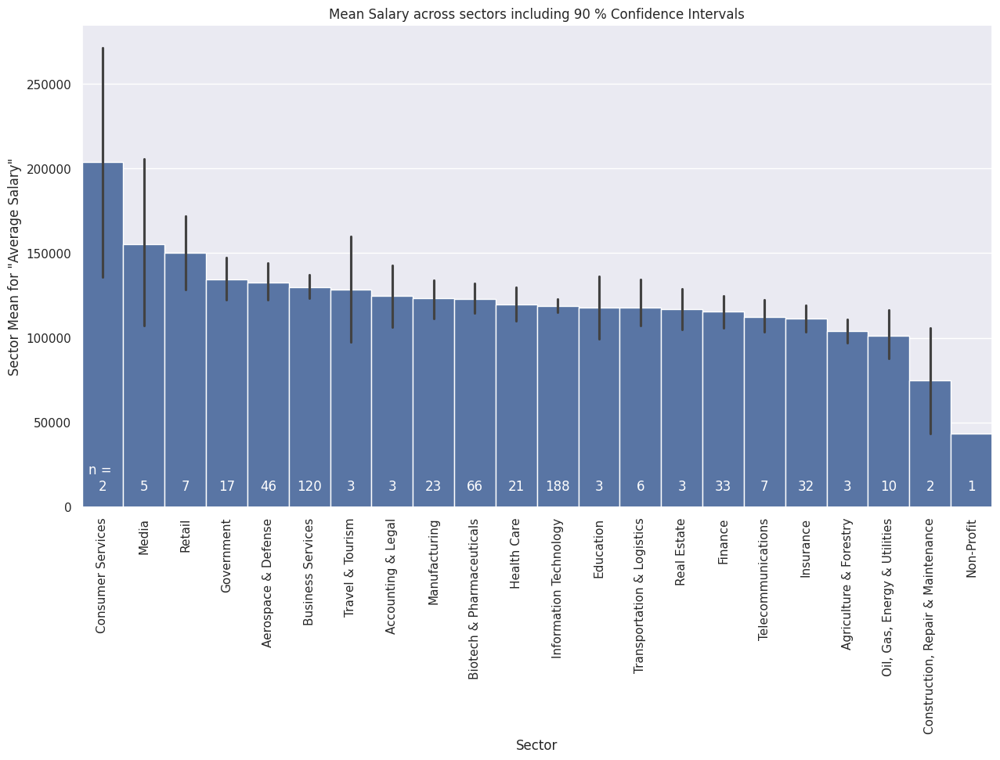

# Exploratory Data Analysis of Data Science Job Market

  
   

# :memo: Description

Starting out in the field of data science can be intimidating. There are alot of job postings online and the requirements vary drastically as data science is a broad field.
What better way to do approach the job search utilizing the data science methodology itself to create insights about job market?
In this project, a scraped data set from Glassdoor containing job postings in the field of data is cleaned and analysed for common trends and potential employers.

# :open_file_folder: Data Set

This project uses a data set that used data science job postings scraped from Glassdoor.com and is currently published on Kaggle.com: 

https://www.kaggle.com/datasets/rashikrahmanpritom/data-science-job-posting-on-glassdoor
